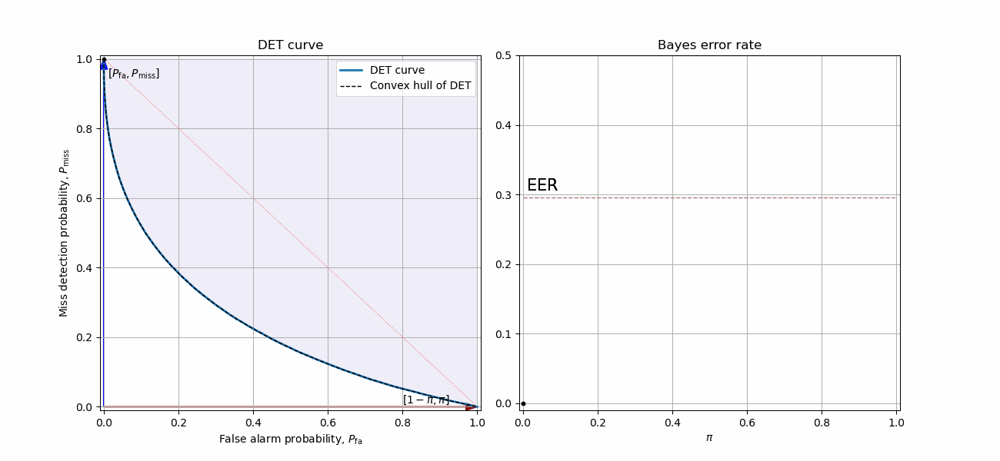
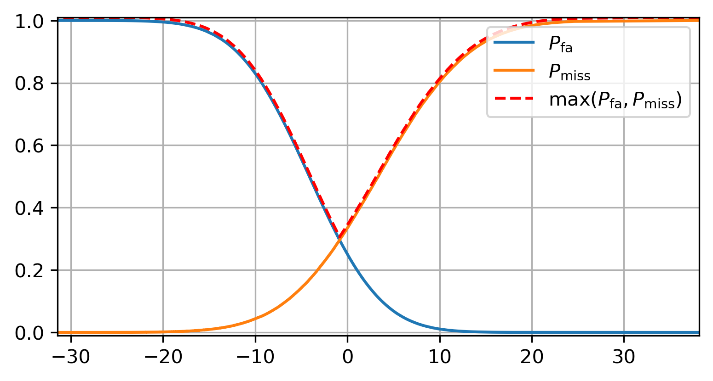

**TLDR: this note illustrates a rearly mentioned property of the equal error rate (ERR) metric in the context of Bayes decision theory and shows its geometric interpretation.**

For the interested reader refer to [^1], [^2].

## Definition
The **Equal Error Rate (EER)** is a performance metric commonly used to evaluate binary classifiers. 
The EER is defined as the point where the **False Acceptance Rate (FAR)** and **False Rejection Rate (FRR)** are equal, providing a single scalar value that balances the two types of errors.

The EER can be derived from the **Receiver Operating Characteristic (ROC)** or from the **Detection Error Tradeoff (DET)** curves. It is defined as the point on the curve for which 
(FAR, FRR) = (EER, EER).

Unlike accuracy, EER is less sensitive to class imbalance because it focuses on the trade-off between FAR and FRR rather than absolute counts.

### Background

Let's start from defining a binary classification problem in the framework of Bayes decision theory:
- **Class prior:** $$P(Y=1) = \pi$$, $$P(Y=0) = 1 − \pi$$.
- **Class-conditional densities:** $p(x∣Y=1)$, $p(x∣Y=0)$.
- **Loss function:** 0-1 loss.

The **Bayes-optimal decision rule** classifies $x$ as class 1 if the **likelihood ratio**:
$\frac{p(x∣Y=1)}{p(x∣Y=0)} \geq \frac{1−\pi}{\pi}$
exceeds the **Bayes threshold**: $$t_\text{Bayes}(\pi) = \frac{1−\pi}{\pi}$$
The total **probability of error** for the given threshold $t$ and prior $\pi$ is:
$$P_\text{error}(\pi, t) = \pi \cdot P_\text{miss}(t) + (1 - \pi) \cdot P_\text{fa}(t)$$
where 
FAR (False Positive Rate): $P_\text{fa}(t)=\int_{t}^{\infty}p(x∣Y=0) dx$
FRR (False Negative Rate): $P_\text{miss}(t)=\int_{-\infty}^{t}p(x∣Y=1) dx$

The **Bayes error rate (BER)** is obtained at the **optimal threshold** $t_\text{Bayes}$ that minimizes $P_\text{error}$:
$$t_\text{Bayes}(\pi) = \arg \min⁡_{t} P_\text{error}(\pi,t)$$
$$\mathrm{BER}(\pi) = P_\text{error}(\pi, t_\text{Bayes}) = \pi \cdot P_\text{miss}(t_\text{Bayes}(\pi))+(1−\pi) \cdot P_\text{fa}(t_\text{Bayes}(\pi))$$
It is the minimum achievable classification error for a given $\pi$.

## EER is an upper bound of the Bayes error rate 

If the prior $\pi$ is **unknown**, we cannot compute $t_\text{Bayes}$. Instead, we may seek the **worst-case minimal error**:
$$\max_{⁡\pi \in [0,1]} \min⁡_{t} P_\text{error}(\pi,t)$$
The inner minimization $\min⁡_t P_\text{error}(\pi,t)$ yields the **Bayes error rate (BER)** for a given $\pi$.
The outer maximization finds the prior $\pi$ that makes BER as large as possible.

### Geometric interpretation

Let's express BER as a dot product

$$P_\text{error}(\pi, t) = \pi \cdot P_\text{miss}(t) + (1 - \pi) \cdot P_\text{fa}(t) = [P_\text{miss}(t), P_\text{fa}(t)] \cdot [\pi, 1 - \pi]$$

To find the wors-case error $\max_{⁡\pi \in [0,1]} \min⁡_{t} P_\text{error}(\pi,t)$, let's first note that the DET (or ROC) curve forms a convex set and serves as its boundary. 
Since a DET curve is convex, the minimum dot product will be achieved at a point $(P_\text{miss}(t), P_\text{fa}(t))$ where the hyperplane (line) orthogonal to $[\pi, 1 - \p]$ supports the curve. 

### Derivation using Sion's theorem

By **Sion’s minimax theorem**, if:
- $P_\text{error}(\pi,t)$ is quasi-convex in $t$, 
- quasi-concave (or linear) in $\pi$,  
then it is possible to **swap** maximization and minimization:
$$\max_{⁡\pi \in [0,1]} \min⁡_{t} P_\text{error}(\pi,t) = \min⁡_{t} \max_{⁡\pi \in [0,1]} P_\text{error}(\pi,t)$$
The right-hand side $\min⁡_{t} \max_{⁡\pi \in [0,1]} P_\text{error}(\pi,t)$ asks: for a **fixed threshold** $t$, what is the **worst** $\pi$?
 
Since $P_\text{error}(\pi,t)=\pi \cdot P_\text{miss}(t) + (1−\pi) \cdot P_\text{fa}(t)$, it is **linear in $\pi$**, the maximum occurs at $\pi = 0$ or $\pi = 1$, depending on whether $P_\text{fa}(t)>P_\text{miss}(t)$:
$$\max_{⁡\pi \in [0,1]} P_\text{error}(\pi,t) = \max(P_\text{fa}(t), P_\text{miss}(t))$$
Thus, the **minimax solution** is the threshold $t_∗$ where the graphs of $P_\text{fa}(t)$ and $P_\text{miss}(t)$ intersect:
$$P_\text{fa}(t_∗)=P_\text{miss}(t_∗)$$
which is precisely the $\mathrm{EER}$.

Given that the **maximin = minimax**, we have:

$\underbrace{\max⁡_{\pi}\mathrm{BER}(\pi)}_\text{Worst-case BER}=\underbrace{\mathrm{EER}}_\text{Minimax error}$

Hence, **EER is the worst-case Bayes error when the prior $\pi$ is unknown**.

Validity of the theorem's application

 
BER is quasi-convex in $t$. The **BER** is given by: $\mathrm{BER}(\pi)=\min_{⁡t}(\pi \cdot P_\text{miss}(t)+(1−\pi) \cdot P_\text{fa}(t))$. The **pointwise minimum of linear functions** is **quasi-convex** (since linear functions are convex and their minimum preserves quasi-convexity). This ensures that **Sion’s theorem applies**, allowing us to swap the min and max.

### Alternative derivation by differentiating the Bayes error rate

We derive the **Equal Error Rate (EER)** as the **worst-case Bayes error** by analyzing how the **Bayes-optimal decision threshold** affects the **False Acceptance Rate (FAR)** and **False Rejection Rate (FRR)** as the **class prior probability** $\pi$ varies. 

We seek the prior $\pi$ that **maximizes BER**, i.e., the worst-case scenario where the classifier performs the poorest.

Differentiating BER with Respect to $\pi$:
$\frac{d}{d \pi} \mathrm{BER}(\pi) = P_\text{miss}(\pi) − P_\text{fa}(\pi) + \pi \frac{d}{d \pi} P_\text{miss}(\pi) + (1 − \pi) \frac{d}{d \pi} P_\text{fa}(\pi)$

Using the Chain Rule on FAR and FRR and since $t_\text{Bayes}(\pi)=\frac{1 - \pi}{\pi}$, we compute:

$\frac{d}{d \pi} P_\text{fa}(\pi)=\frac{dP_\text{fa}}{dt} \cdot \frac{dt_\text{Bayes}}{d\pi}$

$\frac{d}{d \pi}P_\text{miss}(\pi)=\frac{dP_\text{miss}}{dt} \cdot \frac{dt_\text{Bayes}}{d\pi}$

Derivatives of $P_\text{fa}$ and $P_\text{miss}$:

Since $P_\text{fa}(t)=\int_{t}^{\infty}p(x∣Y=0) dx$, we have:

$\frac{dP_\text{fa}}{dt}=−p(t∣Y=0)$

Since $P_\text{miss}(t)=\int_{-\infty}^{t}p(x∣Y=1) dx$, we have:

$\frac{dP_\text{miss}}{dt}=p(t∣Y=1)$

Derivative of the Bayes Threshold $t_\text{Bayes}(\pi)$:

$t_\text{Bayes}(\pi)=\frac{1 - \pi}{\pi}  \Rightarrow  \frac{d t_\text{Bayes}}{d\pi}=−\frac{1}{\pi^2}$

Substituting Back into $\frac{d}{d \pi} \mathrm{BER}(\pi)$:

$\frac{d}{d \pi} \mathrm{BER}(\pi)=P_\text{miss}(\pi)−P_\text{fa}(\pi)+\pi(p(t_\text{Bayes}∣Y=1) \cdot (−\frac{1}{\pi^2}))+(1−\pi)(−p(t_\text{Bayes}∣Y=0) \cdot (−\frac{1}{\pi^2}))$

$=P_\text{miss}(\pi)−P_\text{fa}(\pi) − \frac{p(t_\text{Bayes}∣Y=1)}{\pi} + (1−\pi) \frac{p(t_\text{Bayes}∣Y=0)}{\pi^2}$

At the **Bayes threshold** $t_\text{Bayes}(\pi)$ we have:

$p(t_\text{Bayes}∣Y=1) = \frac{1 - \pi}{\pi} p(t_\text{Bayes}∣Y=0)$

Substituting this into the derivative:

$\frac{d}{d \pi }\mathrm{BER}(\pi)=P_\text{miss}(\pi)−P_\text{fa}(\pi)−\frac{(\frac{1 - \pi}{\pi}p(t_\text{Bayes}∣Y=0))}{\pi} + (1−\pi) \frac{p(t_\text{Bayes}∣Y=0)}{\pi^2}$

$=P_\text{miss}(\pi)−P_\text{fa}(\pi)−(1 - \pi)\frac{p(t_\text{Bayes}∣Y=0)}{\pi^2} + (1−\pi) \frac{p(t_\text{Bayes}∣Y=0)}{\pi^2}$

$=P_\text{miss}(\pi)−P_\text{fa}(\pi)$

The **maximum BER** occurs where $\frac{d}{d \pi} \mathrm{BER}(\pi)=0$:

$P_\text{miss}(\pi)−P_\text{fa}(\pi)=0  \Rightarrow  P_\text{miss}(\pi)=P_\text{fa}(\pi)$

This is precisely the **Equal Error Rate (EER)** condition.

Second derivative check (concavity of BER)

 
To confirm this is a **maximum**, we check the second derivative:
    
$\frac{d^2}{d\pi^2} \mathrm{BER}(\pi) = \frac{d}{d \pi}(P_\text{miss}(\pi)−P_\text{fa}(\pi))$

From earlier:

$\frac{d}{d \pi}P_\text{miss}(\pi) = − \frac{p(t_\text{Bayes}∣Y=1)}{\pi^2}$

$\frac{d}{d \pi}P_\text{fa}(\pi) = \frac{p(t_\text{Bayes}∣Y=0)}{\pi^2}$

Thus:

$\frac{d^2}{d\pi^2} \mathrm{BER}(\pi) = − \frac{p(t_\text{Bayes}∣Y=1)}{\pi^2} − \frac{p(t_\text{Bayes}∣Y=0)}{\pi^2} < 0$

This shows that $\mathrm{BER}(\pi)$ is **concave** in $\pi$, so the critical point is indeed a **maximum**.

#### Geometric interpretation

##### General result

Minimizing a dot product over a convex set

 

Let have a convext set $C$ and a vector $P$ whose endpoint is on a line segment between points $A$ and $B$. For each $P$ we can compute the function $f(P)$ that is a dot product $\langle P, Y \rangle$, minimized over all points $Y$ belonging to the set $C$. Find $P$ that maximizes $f(P)$.

Let's start from expressing $P$ as:
$P(\pi) = A + \pi \cdot (B − A)$
where $\pi$ is a number between $0$ and $1$. 
Then, the problem can be formulated as follows:
$$\max_{\pi \in [0,1]}\min⁡_{Y \in C} \langle P(t), Y \rangle$$
Since $C$ is convex, the minimum dot product over $Y \in C$ will be achieved at a point where the hyperplane orthogonal to $P$ supports the set $C$. 

The objective function for the outer optimization can be re-writte as:
$$ f(\pi) = f(P(\pi)) = \min⁡_{Y \in C} \langle A + \pi \cdot (B − A), Y \rangle = \min⁡_{Y \in C} \langle A, Y \rangle + \pi \cdot \langle B − A, Y \rangle $$

For each fixed $Y$, the expression $\langle A, Y \rangle + \pi \cdot \langle B − A, Y \rangle$ is a straight line in $\pi$. The minimum of a family of straight lines is a **concave** function in $\pi$.
The maximum of $f(t)$ must occur at a point where the derivative with respect to $\pi$ is zero (if such a point exists in $[0, 1]$). So, the maximum occurs where $\langle B − A, Y \rangle = 0$. 

In 2D case the condition $\langle Y, B − A \rangle = 0$ means that the vector $Y$ is perpendicular to the line $AB$. 

##### Relation to the EER 

Let's express BER as a dot product

$$P_\text{error}(\pi, t) = \pi \cdot P_\text{miss}(t) + (1 - \pi) \cdot P_\text{fa}(t) = [P_\text{miss}(t), P_\text{fa}(t)] \cdot [\pi, 1 - \pi]$$

To find the wors-case error

$$\max_{⁡\pi \in [0,1]} \min⁡_{t} P_\text{error}(\pi,t)$$

Let's first note that the DET (or ROC) curve forms a convex set and serves as its boundary (see [^3], [^4] for details).

That is, the inner minimization over the convex set can be replaced by minimization over a scalar $t$. For a fixed $t$, we seek the point $(P_\text{fa}(t) P_\text{miss}(t)$ on the DET curve that minimizes this dot product. The outer maximization can be seen as finding a point $P = (\pi, 1-\pi)$ on a line segment between the points $(0, 1)$ and $(1, 0)$. This formulation matches to the general result obtained before and allows to conclude that the optimal point is on the intersection of the DET curve with the line along the direction $(1, 1)$ which is exactly the EER point $(EER,EER)$.

## References

[^1]: **Brummer, N.** (2010). *Measuring, refining and calibrating speaker and language information extracted from speech.*
[^2]: **Brummer, N., Ferrer, L., Swart, A.** (2021). *Out of a hundred trials, how many errors does your speaker verifier make?*
[^3]: **Cali, C., Longobardi, M.** (2015). *Some mathematical properties of the ROC curve and their applications.*
[^4]: **Gneiting, T., Vogel, P.** (2022). *Receiver operating characteristic (ROC) curves: equivalences, beta model, and minimum distance estimation.*
